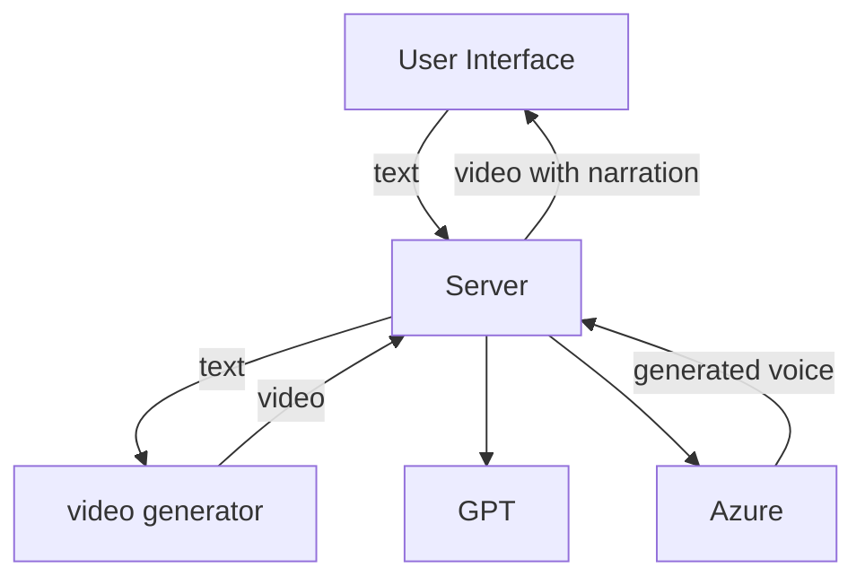
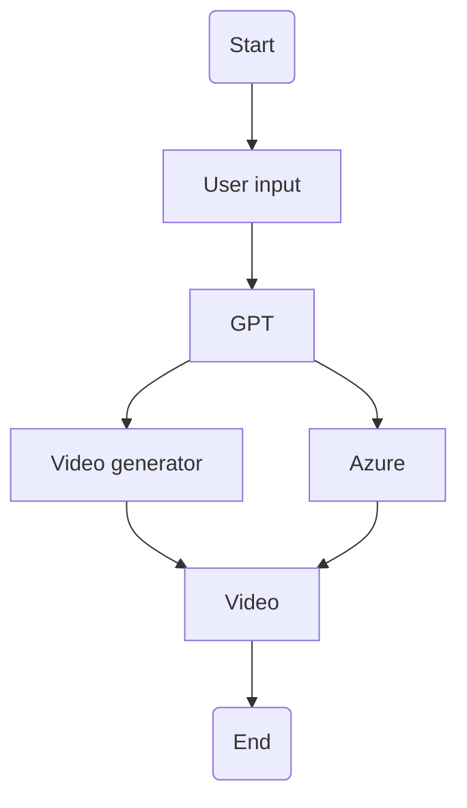

# AI Video Capstone Project

## TODO

- [x] 報告書第二章初稿
- [x] 找如何結合聲音與影片
- [x] 找到適合的影片生成模型 
- [ ] 研究 code
- [ ] 畫系統架構圖
- [ ] 畫系統流程圖
- [ ] 將 ChatGPT 與 Model 結合自動化
- [ ] 整合系統

## Architecture



## Flowchart



## Text and voice

### AzureOpenai.py

this will write text to `text.txt` and voice to `voice.wav`

type `bye` to save text and voice

#### add your api key to environment variable

```shell
export OPENAI_API_KEY=<YOUR_OPENAI_API_KEY>
```

```shell
export AZURE_SPEECH_KEY=<YOUR_AZURE_SPEECH_KEY>
```

## Video Audio Mixing

### MixVideo.py

You need to pip `FFmpeg Python` and `Moviepy` first.

```shell
pip install python-ffmpeg 
```

```shell
pip install moviepy
```

And confirm the path for your `VOICE` and `VIDEO`

The video will be saved in your root directory, You can also change the path according to your own needs.
