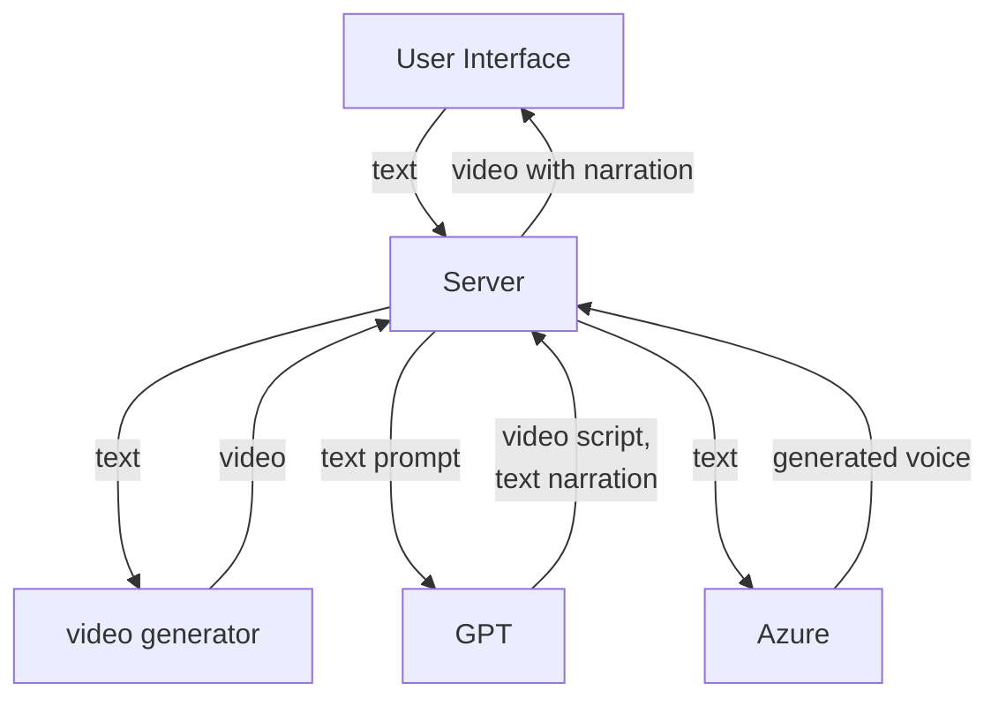
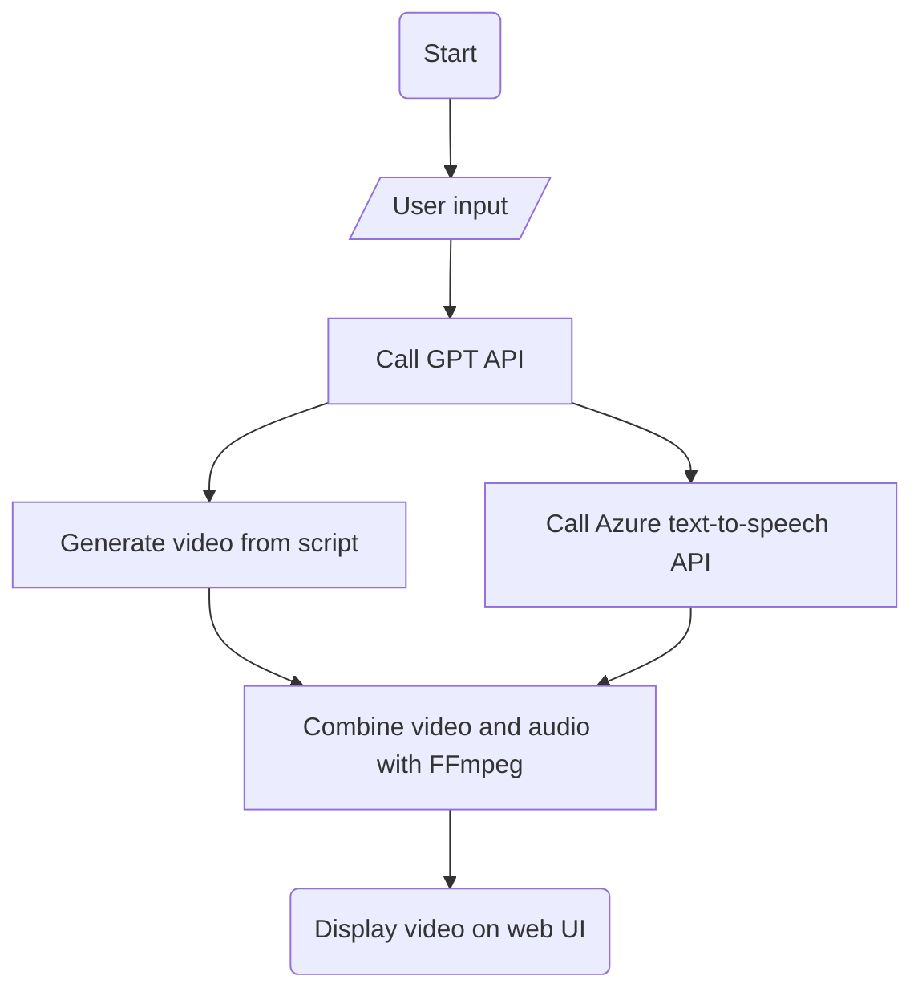
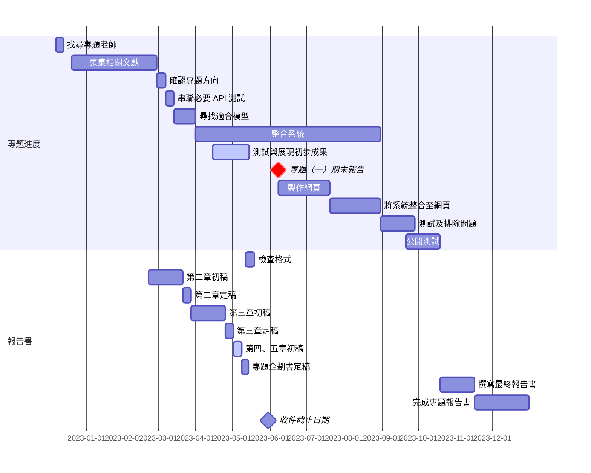

# AI Video Capstone Project(WIP)

## TODO

- [ ] 報告書第三章
- [ ] 完成系統架構圖
- [ ] 完成系統流程圖
- [ ] 完成甘特圖
- [ ] 測試 frame interpolation
- [ ] 將 ChatGPT 與 Model 結合自動化
- [ ] 整合系統

## Architecture



## Flowchart



## Gantt Chart

<!-- FIXME -->


## Text and voice

### AzureOpenaiFuntion.py

This program will modify the user's text and generate speech. It will generate two files, `text.txt` and `voice.wav`, to store the modified text and the corresponding speech, respectively.

#### add your api key to environment variable

```shell
export OPENAI_API_KEY=<YOUR_OPENAI_API_KEY>
```

```shell
export AZURE_SPEECH_KEY=<YOUR_AZURE_SPEECH_KEY>
```

Windows:

```shell
setx OPENAI_API_KEY "REPLACE_WITH_YOUR_KEY_VALUE_HERE" 
```

```shell
setx OPENAI_API_BASE "REPLACE_WITH_YOUR_ENDPOINT_HERE" 
```

```shell
setx AZURE_SPEECH_KEY "YOUR_AZURE_SPEECH_KEY"
```

Notes:

If there is an error with ``` AZURE_SPEECH_REGION ```, please change it to ``` eastasia ```.

## Video Audio Mixing

### MixVideo.py

You need to pip `FFmpeg Python` and `Moviepy` first.

```shell
pip install python-ffmpeg 
```

```shell
pip install moviepy
```

And confirm the path for your `VOICE` and `VIDEO`

The video will be saved in your root directory, You can also change the path according to your own needs.
